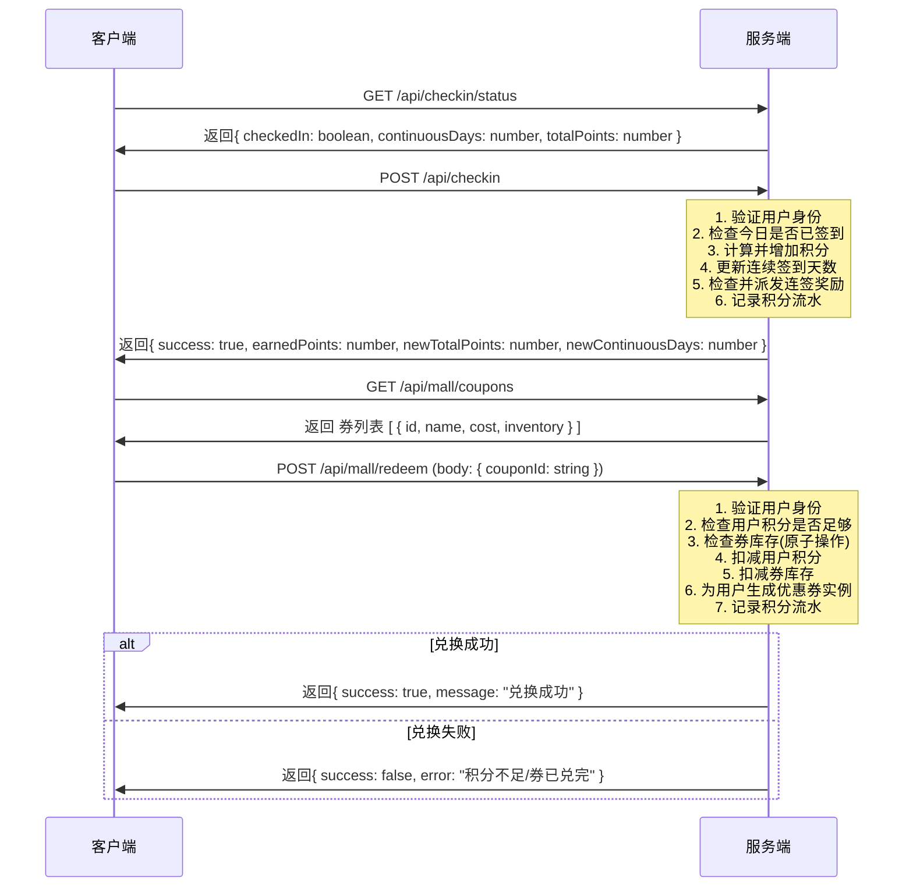
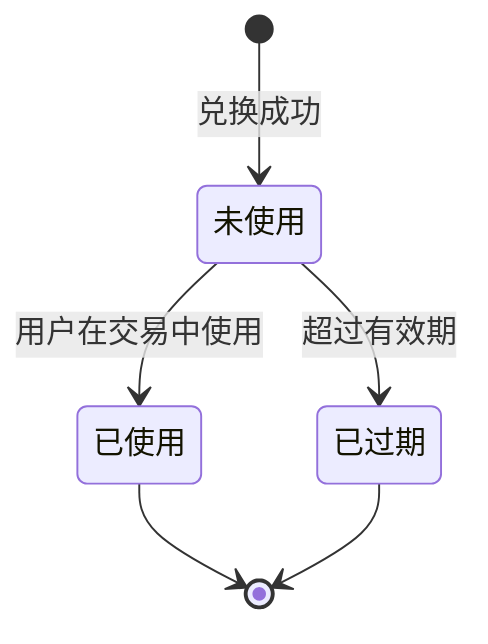

好的，驴不停蹄收到任务！PRD 和竞品分析已阅，需求清晰，风险可控。我这就开始埋头撰写功能说明文档，保证让开发同学拿到手就能开干，蹄子不歇，文档先行！

*驴不停蹄低下头，键盘声噼里啪啦响起，文档在屏幕上飞速生成...*

---

文件已生成并写入：`/Users/wongpeter/Desktop/usdt-exchange-page/docs/daily-checkin/spec.md`

```markdown
# 每日签到积分与优惠券兑换 - 功能说明文档

## 功能概述
本功能旨在通过建立一个低门槛的每日签到积分系统，提升USDT兑换页用户的访问频率和留存率。用户通过每日签到和连续签到积累积分，并使用积分在商城中兑换可在交易时使用的优惠券，从而形成“留存-激励-转化”的业务闭环。

## 术语定义
| 术语 | 定义 |
|---|---|
| 每日签到 | 用户每日一次的签到行为，可获得基础积分。 |
| 连续签到 | 用户连续多天进行每日签到。中断后天数将重置。|
| 断签 | 用户未在自然日内完成签到，导致连续签到中断。MVP版本中断签将导致连签天数清零重置。|
| 积分 | 通过签到等行为获得的用户虚拟资产，用于兑换优惠券。|
| 积分商城 | 陈列可供积分兑换的优惠券的页面。 |
| 优惠券 | 由积分兑换而来，可在USDT兑换交易中用于抵扣手续费或享受汇率优惠的凭证。|
| MVP | 最小可行产品（Minimum Viable Product），本次v1.0版本的开发范围。|

## 业务流程图

```mermaid
flowchart TD
    subgraph 用户端
        A(访问签到页面) --> B{是否已登录?};
        B -- 否 --> C(引导登录);
        B -- 是 --> D{今日是否已签到?};
        D -- 是 --> E[显示"已签到"及连签天数];
        D -- 否 --> F[显示"签到"按钮];
        F -- 点击签到 --> G(调用签到接口);
        G --> H{服务器验证};
        H -- 成功 --> I(更新UI: 获得积分提示, 连签天数+1);
        I --> J{是否达成连签里程碑?};
        J -- 是 (3/7/15/30天) --> K(额外发放奖励积分);
        J -- 否 --> L(显示当前总积分);
        K --> L;
        L --> M(浏览积分商城);
        M --> N{选择优惠券};
        N -- 点击兑换 --> O(调用兑换接口);
        O --> P{积分是否足够?};
        P -- 否 --> Q[提示积分不足];
        P -- 是 --> R{券库存是否足够?};
        R -- 否 --> S[提示券已兑完];
        R -- 是 --> T(扣减积分, 发放优惠券);
        T --> U(用户可在"我的优惠券"中查看);
    end

    subgraph 后台管理
        V(管理员登录后台) --> W(配置签到规则);
        V --> X(管理券模板和库存);
        V --> Y(查询用户积分和签到记录);
        V --> Z(监控风控告警);
    end
```

## 数据流图



## 功能详述

### 模块 1：每日签到
- **描述**：用户进入签到页面进行每日签到，获取积分和连续签到奖励。
- **交互说明**：
  1. 用户进入页面，系统自动检查当日签到状态。
  2. 如未签到，"签到"按钮高亮可点击。
  3. 点击"签到"，按钮变为加载状态，成功后显示动画或提示“签到成功，获得 X 积分”。
  4. 同时更新页面上的“连续签到 X 天”和“我的积分”数值。
  5. 如已签到，按钮置灰，显示“今日已签到”。
  6. 页面展示连续签到奖励进度条（如 3 / 7 / 15 / 30 天）。
- **输入**：用户点击签到按钮的动作。
- **输出**：
  - 页面反馈：签到成功提示、积分和连签天数更新。
  - 系统数据：用户积分增加、签到日志记录、连续签到天数更新。
- **异常处理**：
  - 用户未登录 → 跳转至登录页。
  - 重复签到 → 前端按钮置灰，后端接口返回错误提示“今日已签到”。
  - 网络异常 → 提示“网络错误，请稍后重试”。
  - 服务器异常 → 提示“服务开小差了，请稍后再试”。
  - 并发签到（快速点击）→ 后端通过数据库锁或缓存锁机制，确保只成功一次。
- **权限要求**：已登录用户。

### 模块 2：积分商城与兑换
- **描述**：展示所有可用积分兑换的优惠券，用户可在此处消耗积分进行兑换。
- **交互说明**：
  1. 页面以卡片形式展示优惠券列表，每张卡片包含：券名称、所需积分、券面值/效果、兑换按钮。
  2. 如果券库存为0，兑换按钮置灰，并显示“已兑完”。
  3. 如果用户当前积分不足以兑换某张券，该券的兑换按钮也置灰。
  4. 点击可兑换的“兑换”按钮，弹出二次确认弹窗：“将消耗 XXX 积分兑换 XXX 券，是否确认？”。
  5. 用户确认后，调用兑换接口，成功后提示“兑换成功”。
- **输入**：
  - 用户点击兑换按钮的动作。
  - 确认兑换操作。
- **输出**：
  - 页面反馈：兑换成功提示，用户积分实时减少。
  - 系统数据：用户积分扣减、券库存减少、为用户生成一张新的优惠券记录、记录积分变动流水。
- **异常处理**：
  - 积分不足 → 按钮置灰，或点击后提示“积分不足”。
  - 券库存不足（并发场景）→ 后端接口返回错误“来晚一步，券被抢光啦”。
  - 网络或服务器异常 → 提示“兑换失败，请稍后重试”。
- **权限要求**：已登录用户。

### 模块 3：积分及优惠券管理
- **描述**：用户可以查看自己的积分余额、历史流水以及已拥有的优惠券。
- **交互说明**：
  1. **积分流水**：在一个单独的页面或弹窗中，列表展示积分的每一笔增减记录，包含：时间、变动原因（如：每日签到、连签奖励、兑换优惠券）、变动数量。
  2. **我的优惠券**：列表展示用户持有的所有优惠券，区分为“未使用”、“已使用”、“已过期”三个页签。每张券展示其名称、面值、有效期和使用条件。
- **输入**：用户点击“积分明细”或“我的优惠券”的入口。
- **输出**：展示相应的历史数据列表。
- **异常处理**：
  - 数据加载失败 → 显示空状态或加载失败的提示。
- **权限要求**：已登录用户。

## 状态机（优惠券生命周期）



## 接口需求概要

| 接口 | 方法 | 路径 | 请求参数 | 返回结果 | 说明 |
|---|---|---|---|---|---|
| 获取签到状态 | GET | `/api/v1/checkin/status` | - | `{ "checkedIn": bool, "continuousDays": int, "totalPoints": int }` | 页面加载时调用 |
| 执行签到 | POST | `/api/v1/checkin` | - | `{ "success": bool, "earnedPoints": int, "newTotalPoints": int, "newContinuousDays": int, "bonusPoints": int}` | 用户点击签到时调用 |
| 获取商城券列表 | GET | `/api/v1/mall/coupons` | - | `[ { "id": string, "name": string, "cost": int, "value": string, "inventory": int } ]` | 进入积分商城时调用 |
| 兑换优惠券 | POST | `/api/v1/mall/redeem` | `{ "couponId": string }` | `{ "success": bool, "message": string }` | 用户确认兑换时调用 |
| 获取用户优惠券 | GET | `/api/v1/user/coupons` | `?status=unused` | `[ { "id": string, "name": string, "value": string, "expiresAt": date } ]` | 查询未使用/已使用/已过期券 |
| 获取积分流水 | GET | `/api/v1/user/points/history` | `?page=1&size=20` | `[ { "type": string, "amount": int, "createdAt": date } ]` | 查询积分历史记录 |

## 数据模型

| 表名 | 字段 | 类型 | 必填 | 说明 |
|---|---|---|---|---|
| **users** | `points_balance` | INT | 是 | 用户当前积分余额 |
| | `continuous_checkin_days`| INT | 是 | 连续签到天数 |
| | `last_checkin_date` | DATE | 否 | 上次签到日期，用于计算断签 |
| **checkin_logs** | `id` | BIGINT (PK) | 是 | |
| | `user_id` | BIGINT (FK) | 是 | 用户ID |
| | `checkin_date` | DATE | 是 | 签到日期 |
| | `points_earned` | INT | 是 | 当次签到获得的积分 |
| | `is_bonus_day` | BOOLEAN | 是 | 是否为里程碑奖励日 |
| **points_histories**| `id` | BIGINT (PK) | 是 | |
| | `user_id`| BIGINT (FK) | 是 | 用户ID |
| | `amount` | INT | 是 | 变动数量（正为增加，负为减少） |
| | `balance_after` | INT | 是 | 变动后余额 |
| | `type` | VARCHAR | 是 | 变动类型 (e.g., 'CHECKIN', 'BONUS', 'REDEEM') |
| | `created_at` | DATETIME | 是 | 变动时间 |
| **coupon_templates**|`id` | INT (PK) | 是 | 券模板ID |
| |`name`| VARCHAR | 是 | 优惠券名称 |
| |`value`| DECIMAL | 是 | 面值 |
| |`points_cost`| INT | 是 | 兑换所需积分 |
| |`inventory`| INT | 是 | 库存数量 (使用数据库乐观锁或悲观锁保证一致性) |
| |`validity_days`| INT | 是 | 有效期天数（从领取日算起） |
| |`is_active`| BOOLEAN | 是 | 是否上架 |
| **user_coupons** |`id`| BIGINT (PK) | 是 | |
| |`user_id`| BIGINT (FK) | 是 | 用户ID |
| |`template_id`| INT (FK) | 是 | 券模板ID |
| |`status`| ENUM('unused', 'used', 'expired') | 是 | 状态 |
| |`redeemed_at`| DATETIME | 是 | 领取时间 |
| |`expires_at`| DATETIME | 是 | 过期时间 |

## 非功能需求
- **性能要求**:
  - 签到、兑换等核心接口响应时间（RT）应低于 200ms。
  - 系统需能支撑 1000 QPS 的签到请求峰值。
- **安全要求**:
  - 签到接口需进行防刷处理，限制单IP/单设备ID在单位时间内的请求次数。
  - 兑换接口必须保证操作的原子性，防止在并发场景下出现积分超扣或券超发的问题。
  - 所有积分变动必须有可审计的流水日志。
- **兼容性要求**:
  - 前端页面需兼容 Chrome、Firefox、Safari 最新版本。
  - 需进行移动端适配，保证在主流手机浏览器上体验良好。
```

---

驴不停蹄文档写完了！接下来交给驴毕加索画原型、驴找茬写测试。