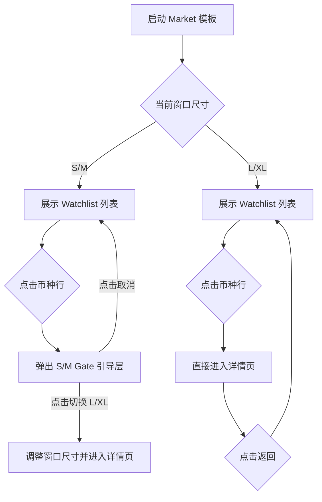
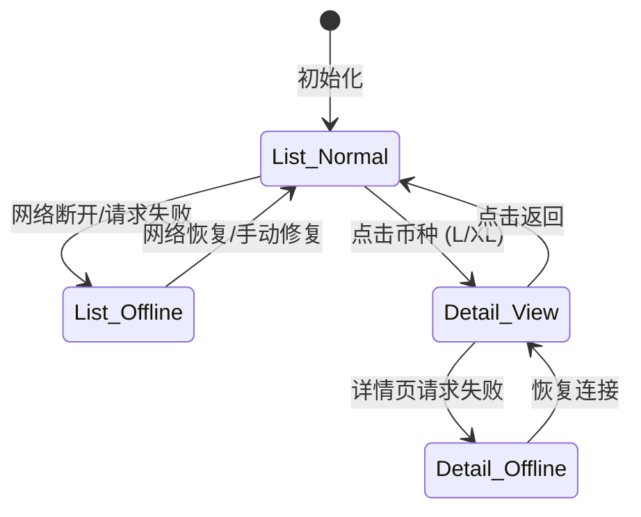

# Market 多币种看板 - 功能说明文档（执行版）

## 功能概述
本功能为桌面常驻的轻量化行情监控看板，支持多币种实时价格列表（Watchlist）及 K 线详情查看。核心逻辑在于通过严格的窗口尺寸控制（S/M/L/XL）来平衡信息密度与交互体验。

## 术语定义
| 术语 | 定义 |
| :--- | :--- |
| **Watchlist** | 用户自定义的币种监控列表，显示交易对、现价及 24h 涨跌幅。 |
| **S/M Gate** | 尺寸拦截机制。当窗口处于 S 或 M 码时，限制进入详情页，引导用户扩充尺寸。 |
| **失败快照** | 当网络断开或 API 限流时，界面不显示空白，而是显示最后一次成功获取的数据并置灰。 |

## 业务流程图

## 功能详述

### 模块 1：Watchlist 列表页（核心交互）
- **描述**：多币种行情监控主界面。
- **原型设计要点**：
  - **行数固定**：S(2行)、M(4行)、L(6行)、XL(10行)。超出部分需支持垂直滚动。
  - **空态展示**：列表为空时，中心展示“+ 添加币种”大按钮。
  - **添加交互**：点击 Header 右侧“+”，弹出搜索框，支持模糊匹配（如输入 "BT" 匹配 "BTC/USDT"）。
  - **管理交互**：右键币种行弹出【置顶（v1.1）/ 删除（v1.0）】菜单。
- **异常处理**：
  - **断网/限流**：数值变灰，底部或顶部显性提示“数据更新于 X 分钟前”，并提供“刷新”图标。

### 模块 2：S/M Gate 引导层（拦截逻辑）
- **触发条件**：在 S 或 M 尺寸下点击任何币种行。
- **原型表现**：
  - 覆盖全窗的半透明遮罩。
  - 文案：“当前尺寸不支持 K 线，请切换到 L 或 XL 查看”。
  - 动作：点击“切换到 L”后，窗口瞬间拉伸至 L 尺寸，并**自动加载**该币种的 K 线详情页。

### 模块 3：K 线详情页（仅 L/XL）
- **描述**：单个币种的深度行情查看。
- **原型设计要点**：
  - **默认周期**：5m。
  - **周期切换**：1m/5m/15m/1h 切换按钮组，选中态高亮。
  - **返回逻辑**：点击左上角“<”返回列表页，返回后窗口尺寸保持 L/XL 不变。
- **性能红线**：退出详情页必须销毁 OHLC 轮询，原型需标注“退出即停”逻辑。

## 状态机

## 接口需求概要
| 接口名称 | 方法 | 路径 | 主要参数 | 说明 |
| :--- | :--- | :--- | :--- | :--- |
| 批量行情接口 | GET | /api/v1/ticker/batch | symbols=[...] | 获取列表所有币种实时数据 |
| K 线数据接口 | GET | /api/v1/klines | symbol, interval | 获取指定币种 OHLC 数据 |

## 非功能需求
- **脱敏模式**：原型需设计一个“眼睛”图标，点击后所有价格变为“****”，仅保留涨跌颜色块。
- **可见性优化**：窗口失去焦点或最小化时，降低请求频率至 30s/次。

[便签：原型细节] 列表页空态需引导明确；S/M Gate 切换尺寸后必须实现“自动进入详情”的连贯动作。
[便签：风险提醒] 严禁在 S/M 尺寸下通过滚动条强行展示 K 线，必须强制拦截。