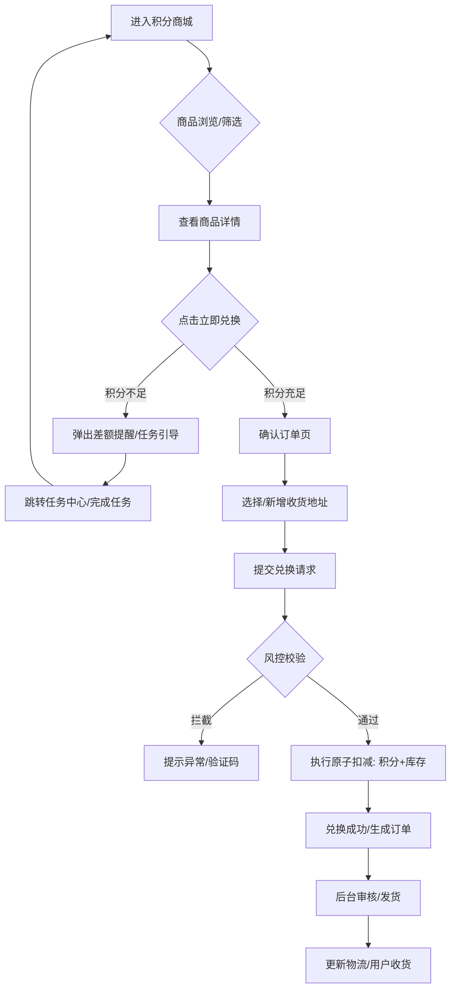
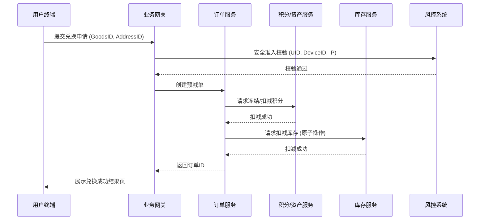
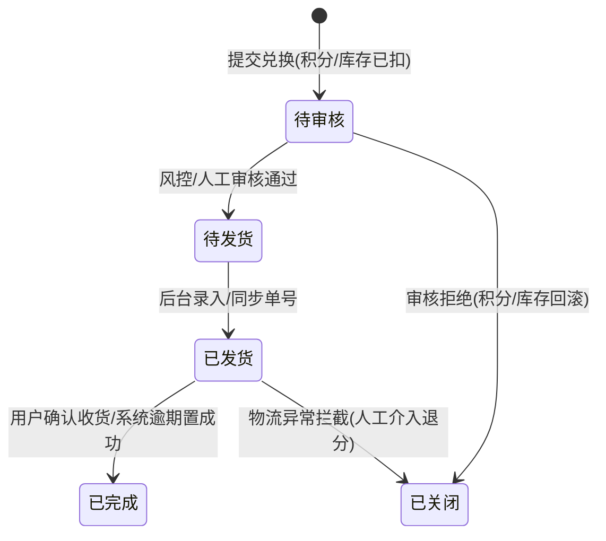

# 积分兑换商品 - 功能说明文档

## 功能概述
建立积分消耗闭环，通过电商化兑换链路提升积分价值感。核心机制包含：标准实物兑换流程、库存与限购管理、以及针对积分不足场景的“任务补足”引导。通过风控校验与任务联动，实现用户活跃度与复购率的同步提升。

## 术语定义
| 术语 | 定义 |
| :--- | :--- |
| **可用积分** | 用户当前账户内可立即用于兑换的活跃积分。 |
| **冻结积分** | 用户下单后但未完成审核/发货前，系统暂时锁定的积分，防止重复使用。 |
| **积分差额** | 兑换目标商品所需积分与用户当前可用积分的数值差距。 |
| **原子扣减** | 数据库完成下单时，库存减 1 与积分扣除（或冻结）必须同时成功或同时失败。 |
| **任务补足** | 积分不足时，系统自动匹配并推荐可填补差额的特定任务。 |

## 业务流程图

## 数据流图

## 功能详述

### 模块 1：商城首页及详情
- **描述**：集成商品展示、分类导航与个人积分资产概览。
- **交互说明**：
  - 顶部固定展示用户当前总积分。
  - 支持按“我能兑换的”（积分区间）进行筛选。
  - 详情页展示：商品原价（锚定）、所需积分、库存状态、预计发货时间（如：预计3个工作日内发货）。
- **输入**：筛选条件、点击行为。
- **输出**：商品列表、动态积分余额。
- **异常处理**：
  - 商品下架 → 详情页显示“已下架”且无法点击兑换。
  - 库存为0 → 显示“已兑完”，展示“到货提醒”按钮。
- **权限要求**：登录用户。

### 模块 2：兑换确认与地址管理
- **描述**：处理兑换前的最后确认信息。
- **交互说明**：
  - 默认加载用户上一次使用的或设置的默认地址。
  - 支持在当前页唤起地址编辑/新增浮层。
- **输入**：收货人信息、电话、详细地址。
- **异常处理**：
  - 地址不符合规则（格式错误） → 实时校验提示。
  - 偏远地区/黑名单地址 → 提交时提示“该地区暂不支持寄送”。
- **权限要求**：登录用户且完成基础KYC（如适用）。

### 模块 3：差额任务引导 (P1)
- **描述**：在用户积分不足以兑换目标商品时进行转化引导。
- **交互说明**：
  - 弹出浮层提示：“还差 50 积分即可兑换”。
  - 动态展示 1-2 个能快速获得 50 积分的任务（如：每日签到、分享好友）。
  - 点击引导直接跳转至对应任务。
- **逻辑要求**：
  - 用户从任务页返回商城时，需通过 WebHook 或前端主动触发积分余额拉取。

### 模块 4：后台管理系统
- **描述**：运营人员对商品和订单的维护。
- **主要操作**：
  - **库存管理**：设置独立积分库存，支持批量上下架。
  - **限购设置**：配置单人/单次/单日兑换上限。
  - **订单导出与回填**：
    - 支持导出“待发货”状态的 CSV/Excel 清单。
    - **批量发货**：支持上传包含“订单号+快递商+单号”的 Excel 实现一键发货。
- **权限要求**：商城管理员、财务审计人员。

## 状态机（订单系统）

## 接口需求概要

| 接口名称 | 方法 | 路径 | 主要参数 | 说明 |
| :--- | :--- | :--- | :--- | :--- |
| 获取积分商品列表 | GET | /v1/points/goods | page, category, min_score | 支持按积分区间聚合 |
| 提交兑换订单 | POST | /v1/points/exchange | goods_id, address_id, quantity | 核心交易接口，需幂等 |
| 获取任务补足建议 | GET | /v1/points/suggest-tasks | gap_score | 根据差额返回匹配任务 |
| 批量发货导入 | POST | /v1/admin/orders/batch-ship | file_url | 后台批量更新物流信息 |

## 数据模型

| 字段名 | 类型 | 必填 | 说明 |
| :--- | :--- | :--- | :--- |
| goods_id | String | 是 | 商品唯一 ID |
| points_price | Decimal | 是 | 兑换所需积分数值 |
| market_price | Decimal | 否 | 市场参考价（用于价值锚定） |
| total_stock | Int | 是 | 总库存 |
| user_limit | Int | 是 | 单用户终身/每日限购数 |
| estimated_days | Int | 是 | 预计发货周期（天） |
| status | Enum | 是 | 0-下架, 1-上架, 2-预售 |

## 非功能需求
1. **并发控制**：库存扣减必须使用分布式锁或数据库行锁，确保在高并发下不超卖。
2. **数据一致性**：积分扣减与订单创建需支持分布式事务，或引入补偿机制保证最终一致。
3. **风控**：订单接口需限流（Rate Limiting），并校验设备指纹。
4. **性能**：商城首页及详情页在高并发期间应采用 CDN/Redis 缓存，数据延迟允许在 5s 内。