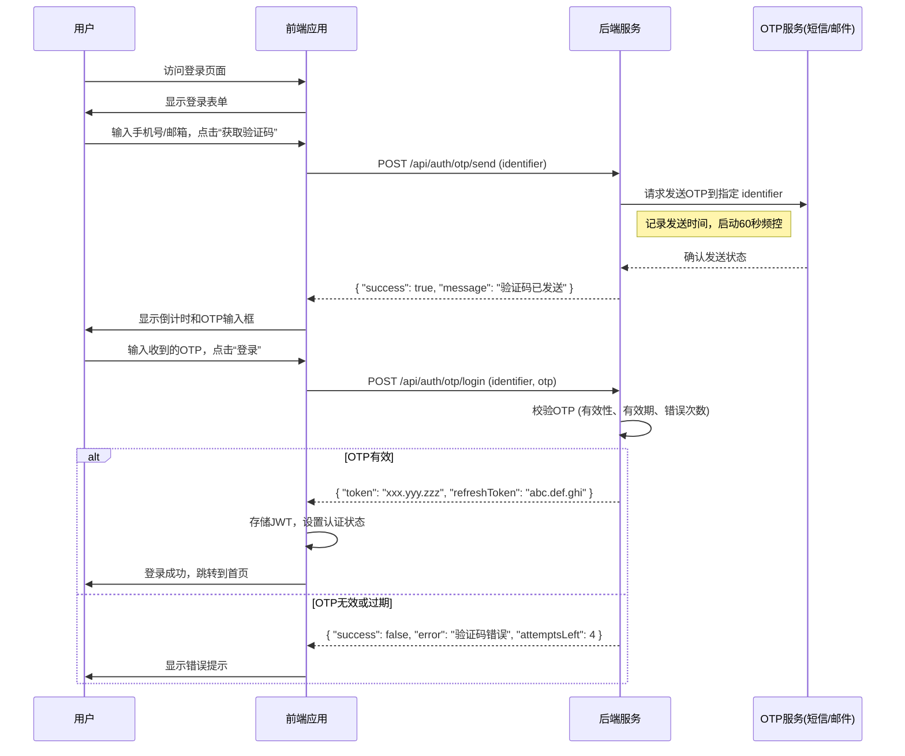
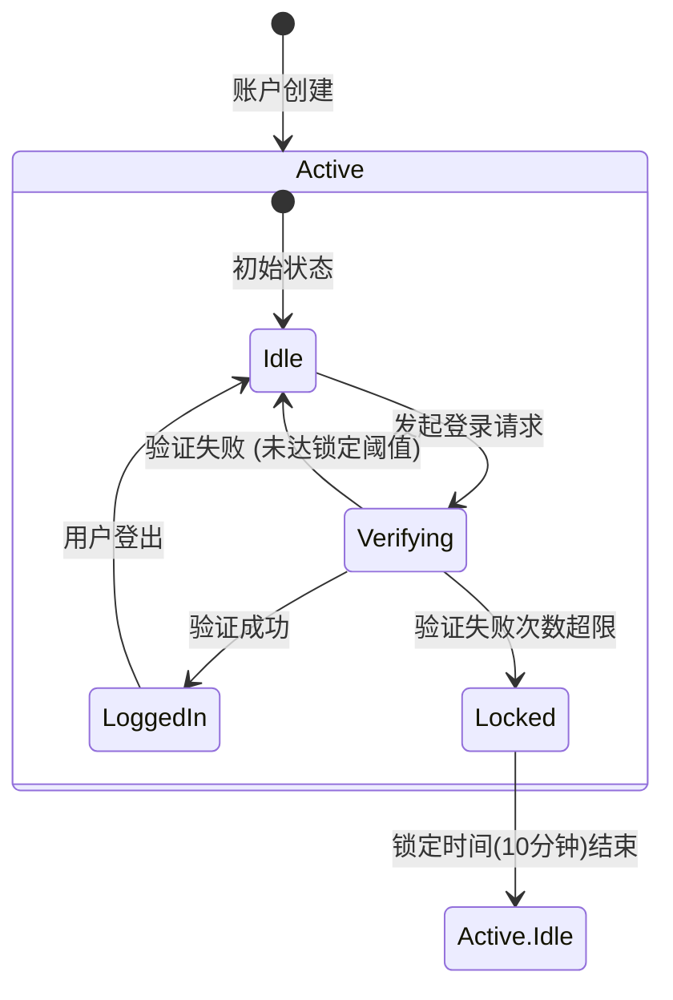

好的，文档撰写工程师已就位。

我已详细阅读 `prd.md`（PRD 定稿）和 `competitor-analysis.md`（竞品分析）文件。基于这些信息，我现在开始撰写功能说明文档。

文档将严格按照 MVP 范围（v1.0）和 P1 级别的功能进行详细说明，确保开发团队可以无歧义地进行开发。

---

文档已生成并写入 `/Users/wongpeter/Desktop/usdt-exchange-page/docs/test-login/spec.md`。

以下是文档内容：

# 用户登录功能 - 功能说明文档

## 功能概述
本功能为系统提供核心的用户身份认证能力，主要服务于测试环境。它以手机号/邮箱 OTP（一次性密码）作为主要登录方式，账号密码登录为备用方案，旨在为内部用户和测试人员提供一个稳定、快速且安全的登录流程。系统通过 JWT (JSON Web Token) 管理用户会话，并包含基础的安全防护机制。

## 术语定义
| 术语 | 定义 |
| --- | --- |
| OTP | One-Time Password，一次性密码。通过短信或邮件发送的、有短暂有效期的动态验证码。 |
| JWT | JSON Web Token，一种开放标准（RFC 7519），用于在各方之间安全地传输信息作为 JSON 对象。 |
| 会话 | Session，用户从登录到退出的整个周期，系统通过会话来识别已认证的用户。 |
| 设备记忆 | 指系统记住用户在特定设备上的登录状态，在有效期内（30天）免去或简化登录验证步骤。 |
| 频控 | 频率控制（Rate Limiting），限制特定操作（如发送OTP）在单位时间内的执行次数。 |

## 业务流程图

```mermaid
flowchart TD
    subgraph 主要流程：OTP 登录
        A[用户访问登录页] --> B{选择登录方式};
        B -- 手机号/邮箱OTP --> C[输入手机号/邮箱];
        C --> D{格式校验};
        D -- 格式错误 --> E[提示格式错误];
        D -- 格式正确 --> F[点击“获取验证码”];
        F --> G{60秒发送冷却校验};
        G -- 冷却中 --> H[提示“操作频繁，请稍后再试”];
        G -- 可发送 --> I[后端服务发送OTP];
        I --> J[用户输入收到的OTP];
        J --> K[点击“登录”];
        K --> L{后端校验OTP};
        L -- 校验失败/过期 --> M[提示错误，剩余次数-1];
        M --> N{错误次数 >= 5?};
        N -- 是 --> O[锁定账号10分钟];
        N -- 否 --> J;
        L -- 校验成功 --> P[登录成功，生成JWT];
        P --> Q[跳转到受保护页面];
    end

    subgraph 备用流程：账号密码登录
        B -- 账号密码 --> R[输入账号和密码];
        R --> S[点击“登录”];
        S --> T{后端校验凭据};
        T -- 凭据错误 --> M;
        T -- 凭据正确 --> P;
    end
```

## 数据流图



## 功能详述

### 模块 1：OTP 登录（手机/邮箱）
- **描述**：系统的核心登录方式。用户通过接收并输入发送到其手机或邮箱的一次性密码来完成身份认证。
- **交互说明**：
  1. 用户在登录页输入手机号或邮箱地址。
  2. 点击“获取验证码”按钮。
  3. 系统校验该号码/邮箱，若通过，按钮变为不可点状态并开始60秒倒计时。
  4. 用户在5分钟内输入收到的6位数字验证码。
  5. 点击“登录”按钮。
  6. 验证成功后，系统进入登录状态并跳转到业务主页。
- **输入**：
  - `identifier` (string): 手机号或邮箱地址。
  - `otp` (string): 6位数字验证码。
- **输出**：
  - 成功：返回 JWT，前端重定向页面。
  - 失败：在页面上显示明确的错误提示。
- **异常处理**：
  - 手机号/邮箱格式不正确 → 提示“请输入有效的手机号/邮箱地址”。
  - 用户不存在 → （根据安全策略）提示“用户不存在”或统一提示“手机号/邮箱或验证码错误”。
  - 60秒内重复请求验证码 → 提示“操作频繁，请在x秒后重试”。
  - OTP验证码输入错误 → 提示“验证码错误，您还有X次机会”。
  - OTP错误次数超过5次 → 提示“错误次数过多，账号已锁定，请10分钟后重试”。
  - OTP已过期（超过5分钟） → 提示“验证码已过期，请重新获取”。
- **权限要求**：公共权限（任何人可访问）。

### 模块 2：账号密码登录
- **描述**：作为OTP登录的备用方案，提供传统的账号密码登录方式，主要用于测试或紧急情况。
- **交互说明**：
  1. 用户在登录页切换到“账号密码登录”。
  2. 输入账号（用户名或邮箱）和密码。
  3. 点击“登录”按钮。
  4. 验证成功后，系统进入登录状态并跳转到业务主页。
- **输入**：
  - `username` (string): 用户名或邮箱。
  - `password` (string): 密码（长度至少8位）。
- **输出**：
  - 成功：返回 JWT，前端重定向页面。
  - 失败：显示错误提示。
- **异常处理**：
  - 账号或密码错误 → 提示“账号或密码错误”。
  - 连续密码错误次数过多 → 触发与OTP登录相同的账号锁定机制。
- **权限要求**：公共权限。

### 模块 3：登录态管理与设备管理
- **描述**：使用 JWT 进行无状态会话管理，并提供设备记忆和管理功能。
- **交互说明**：
  - **登录态维持**：登录成功后，后续请求的 Header 中自动携带 JWT。
  - **设备记忆**：用户在登录时勾选“30天内免登录”，系统将颁发一个长效的刷新令牌（Refresh Token）。
  - **设备列表**：用户可以在“账户设置-安全设置”页面查看当前所有已登录的设备列表（包含设备类型、IP地址、最近登录时间）。
  - **退出所有设备**：用户可以点击“退出所有设备”按钮，使所有已颁发的 JWT 及刷新令牌失效。
- **输入**：
  - `Authorization` Header: `Bearer <jwt_token>`
  - 退出所有设备操作：用户确认。
- **输出**：
  - 成功访问受保护资源。
  - 设备列表展示。
  - 所有设备被强制下线，需要重新登录。
- **异常处理**：
  - JWT 过期 → 返回 401 Unauthorized，前端应使用 Refresh Token 尝试静默刷新，若刷新失败则引导用户重新登录。
  - JWT 无效/被篡改 → 返回 401 Unauthorized，要求用户重新登录。
- **权限要求**：已登录用户。

## 状态机（用户账户安全状态）



## 接口需求概要

| 接口 | 方法 | 路径 | 请求参数 | 返回结果 | 说明 |
| --- | --- | --- | --- | --- | --- |
| 发送OTP | POST | `/api/auth/otp/send` | `{"identifier": "string"}` | `{"success": true}` | 发送OTP到手机或邮箱 |
| OTP登录 | POST | `/api/auth/otp/login` | `{"identifier": "string", "otp": "string"}` | `{"token": "string", "refreshToken": "string"}` | 使用OTP进行登录 |
| 密码登录 | POST | `/api/auth/password/login` | `{"username": "string", "password": "string"}` | `{"token": "string", "refreshToken": "string"}` | 使用账号密码登录 |
| 刷新令牌 | POST | `/api/auth/token/refresh` | `{"refreshToken": "string"}` | `{"token": "string"}` | 使用刷新令牌获取新的访问令牌 |
| 退出登录 | POST | `/api/auth/logout` | (空) | `{"success": true}` | 使当前会话失效 |
| 退出所有设备 | POST | `/api/auth/logout-all` | (空) | `{"success": true}` | 使该用户所有会话失效 |
| 获取设备列表 | GET | `/api/user/devices` | (空) | `[{"id": "...", "type": "...", "ip": "...", "lastSeen": "..."}]` | 查看已登录设备 |

## 数据模型

| 表名 | 字段 | 类型 | 必填 | 说明 |
| --- | --- | --- | --- | --- |
| **users** | `id` | UUID | 是 | 主键 |
| | `username` | VARCHAR(50) | 否 | 用户名（用于密码登录） |
| | `email` | VARCHAR(100) | 否 | 邮箱，唯一 |
| | `phone` | VARCHAR(20) | 否 | 手机号，唯一 |
| | `password_hash` | VARCHAR(255) | 否 | bcrypt/argon2 加盐哈希后的密码 |
| | `status` | ENUM('active', 'locked', 'inactive') | 是 | 账户状态 |
| | `lockout_until` | TIMESTAMP | 否 | 账户锁定截止时间 |
| | `created_at` | TIMESTAMP | 是 | 创建时间 |
| **login_logs** | `id` | BIGINT | 是 | 主键 |
| | `user_id` | UUID | 是 | 关联用户ID |
| | `ip_address` | VARCHAR(45) | 是 | 登录IP地址 |
| | `user_agent` | TEXT | 是 | 设备信息 |
| | `status` | ENUM('success', 'failed') | 是 | 登录结果 |
| | `timestamp` | TIMESTAMP | 是 | 登录时间 |
| **active_sessions** | `id` | UUID | 是 | 主键 |
| | `user_id` | UUID | 是 | 关联用户ID |
| | `refresh_token_hash` | VARCHAR(255) | 是 | 刷新令牌的哈希值 |
| | `device_info` | VARCHAR(255) | 是 | 简化版设备信息（如 Chrome on macOS） |
| | `ip_address` | VARCHAR(45) | 是 | 颁发令牌时的IP |
| | `expires_at` | TIMESTAMP | 是 | 刷新令牌过期时间 |
| | `last_seen` | TIMESTAMP | 是 | 最近使用时间 |

## 非功能需求
- **性能要求**:
  - 核心登录接口（OTP/密码）在95%的情况下，响应时间应小于200ms。
  - 系统应能支持至少100个并发用户同时发起登录请求。
  - OTP发送成功率应高于95%。
- **安全要求**:
  - 所有密码和敏感令牌必须在数据库中加盐哈希存储，严禁明文。
  - 所有API通信必须通过 HTTPS。
  - JWT应存储在`HttpOnly`、`Secure`的 Cookie 中，以防范 XSS 攻击。
  - 必须通过基础的渗透测试，能抵御常见的暴力破解、重放攻击、SQL注入等。
- **兼容性要求**:
  - 前端界面需兼容最新版本的 Chrome, Firefox, Safari 浏览器。

---

功能说明文档完成，可以启动原型设计和测试用例编写。